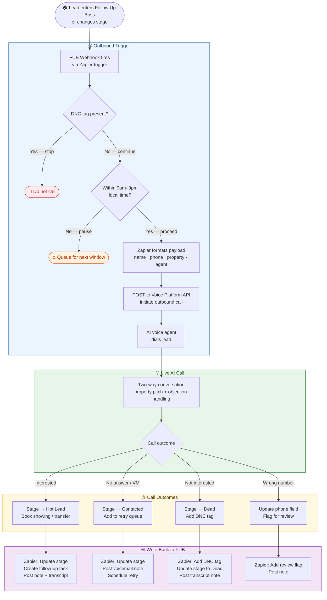
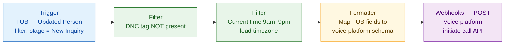
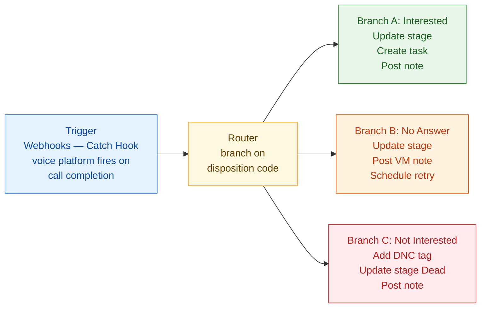

# 🏠 AI Real Estate Calling System

> An AI-powered outbound calling platform for real estate. Pulls leads from Follow Up Boss, places calls via an AI voice agent, and logs outcomes back to the CRM — automatically.

[](LICENSE)
[](https://podman.io)
[](https://fedoraproject.org)
[](https://followupboss.com)
[](#compliance)

---

## Table of Contents

- [Overview](#overview)
- [Architecture](#architecture)
- [Voice Platform Options](#voice-platform-options)
- [Qwen3-TTS — Open-Source Voice Engine](#qwen3-tts--open-source-voice-engine)
- [Follow Up Boss Integration Flow](#follow-up-boss-integration-flow)
- [Project Phases](#project-phases)
- [Directory Structure](#directory-structure)
- [Getting Started](#getting-started)
- [Compliance](#compliance)
- [Platform Comparison](#platform-comparison)
- [Open Decisions](#open-decisions)

---

## Overview

This system automates the outbound lead qualification process for a real estate company:

1. A new lead enters **Follow Up Boss** (FUB) — or changes stage
2. A **Zapier / Make** automation fires, formats the payload, and checks DNC status
3. An **AI voice agent** calls the lead and holds a natural conversation about the property
4. The call outcome is posted back to **Follow Up Boss** — stage updated, note saved, task created

The entire stack runs on **AWS EC2 (Fedora 41)** using **Podman** containers. No Docker daemon required.

---

## Architecture

```
┌─────────────────────────────────────────────────────────────┐
│                     EC2 — Fedora 41 (Podman)                │
│                                                             │
│   ┌─────────────┐   ┌─────────────┐   ┌─────────────┐      │
│   │    api/     │   │   worker/   │   │   redis/    │      │
│   │  FastAPI /  │◄──│   Queue     │◄──│  Job queue  │      │
│   │  Slim PHP   │   │   Runner    │   │  Call state │      │
│   └──────┬──────┘   └──────┬──────┘   └─────────────┘      │
│          │                 │                                 │
└──────────┼─────────────────┼─────────────────────────────────┘
           │                 │
    ┌──────▼─────────────────▼──────┐
    │       Zapier / Make           │
    │  Trigger routing + FUB writes │
    └──────┬────────────────────────┘
           │
    ┌──────▼──────┐       ┌──────────────────┐
    │  Voice      │       │  TTS Engine       │
    │  Platform   │◄─────►│  ElevenLabs /     │
    │  VAPI /     │       │  Qwen3-TTS        │
    │  Synthflow /│       └──────────────────┘
    │  Retell /   │
    │  Bland AI   │
    └──────┬──────┘
           │
    ┌──────▼──────┐
    │ Follow Up   │
    │ Boss (CRM)  │
    │ Leads in,   │
    │ outcomes out│
    └─────────────┘
```

---

## Voice Platform Options

Four platforms have been evaluated. The system uses an **adapter pattern** so the voice provider is swappable without changing the core orchestration logic.

### Platform Summary

| | VAPI | Synthflow | Bland AI | Retell AI |
|---|---|---|---|---|
| **Best for** | Dev teams | Non-technical | Enterprise / high-volume | Production teams |
| **No-code setup** | ❌ | ✅ | ❌ | Partial |
| **Real cost / min** | $0.13–$0.30 | $0.15–$0.24 | $0.09+ (add-ons) | $0.11–$0.15 |
| **Latency** | <600ms | ~700ms | ~800ms | ~600ms |
| **Languages** | 100+ (via provider) | 30+ | English primary | 30+ |
| **FUB integration** | Zapier / Webhook | Zapier (native) | API / Zapier | API / Zapier |
| **Post-call analytics** | Basic webhook | Basic dashboard | Strong logging | Auto summary + sentiment |
| **Compliance** | HIPAA +$1k/mo | HIPAA available | Strong audit logs | SOC 2 + HIPAA + GDPR |
| **Uptime** | 99.94% | ~99.9% | 99.94% | 99.99% |
| **Free trial** | $10 credits | 14 days | None | $10 credits |

### Recommended Path

```
No developer available     → Synthflow   (no-code, real estate templates, 14-day trial)
One developer available    → Retell AI   (best quality, analytics, branded caller ID)
Full dev team              → VAPI        (maximum control, pluggable stack)
10,000+ calls/day          → Bland AI    (dedicated GPU, 20k calls/hour capacity)
```

---

## Qwen3-TTS — Open-Source Voice Engine

[Qwen3-TTS](https://huggingface.co/spaces/Qwen/Qwen3-TTS) is an open-source TTS model by Alibaba Cloud (Apache 2.0) that can replace ElevenLabs in the voice stack — eliminating per-character TTS fees at self-hosted scale.

| Attribute | Detail |
|---|---|
| **Released** | January 2026 |
| **License** | Apache 2.0 — free for commercial use |
| **Models** | 0.6B (fast) and 1.7B (flagship); Flash / Realtime variants |
| **Latency** | 97ms first-packet (Flash-Realtime) |
| **Languages** | 10: EN, ZH (+ dialects), JA, KO, DE, FR, RU, PT, ES, IT |
| **Voice cloning** | 3-second clone from reference audio; cross-lingual |
| **Voice design** | Describe a voice in natural language → model generates it |
| **Training data** | 5M+ hours of multilingual speech |
| **Benchmarks** | Outperforms ElevenLabs, MiniMax, GPT-4o Audio on multilingual WER |
| **Hardware** | RTX 3090+ for production; runs on CPU (slower) |
| **Integration** | `qwen-tts` Python lib, REST API, vLLM — plugs into VAPI / Retell as custom TTS |

### How Qwen3-TTS fits this stack

```
VAPI / Retell AI
      │
      ▼  (custom TTS endpoint)
  Qwen3-TTS  ←── self-hosted on EC2 GPU
      │
      ▼
  Audio stream → caller's phone
```

> **Cost impact:** At self-hosted scale, Qwen3-TTS eliminates ~$0.03–$0.05/min in ElevenLabs TTS fees per call minute.

---

## Follow Up Boss Integration Flow

> FUB has no native connector for any of the four voice platforms. All integrations route through **Zapier**, **Make**, or the **FUB REST API**.

### Full Flow Diagram



---

### Zapier Zap Structure

#### Zap 1 — Outbound Trigger (FUB → Voice Platform)



#### Zap 2 — Post-Call Return (Voice Platform → FUB)



---

### FUB API Endpoints Used

| Action | Method | Endpoint |
|---|---|---|
| Update lead stage | `PATCH` | `/v1/people/{id}` |
| Add call note + transcript | `POST` | `/v1/notes` |
| Create follow-up task | `POST` | `/v1/tasks` |
| Add DNC tag | `PATCH` | `/v1/people/{id}` → `tags` array |

All calls authenticated via FUB API key in `Authorization: Bearer` header.

---

## Project Phases

```mermaid
gantt
    title AI Real Estate Calling System — Build Phases
    dateFormat  YYYY-MM-DD
    section Phase 0 — Foundations
    Choose CRM & voice platform          :done, p0a, 2026-04-01, 7d
    Choose orchestration language        :done, p0b, 2026-04-01, 7d
    Set up GitHub repo + branch strategy :done, p0c, 2026-04-05, 3d
    section Phase 1 — Core Infrastructure
    EC2 + Fedora 41 + Podman setup       :active, p1a, 2026-04-08, 5d
    Podman Compose (api, worker, redis)  :p1b, after p1a, 5d
    CRM adapter interface + FUB adapter  :p1c, after p1a, 7d
    Zapier outbound trigger Zap          :p1d, after p1c, 3d
    Zapier return / writeback Zap        :p1e, after p1d, 3d
    section Phase 2 — AI Voice Agent
    Voice platform account + API keys    :p2a, after p1e, 2d
    Agent prompt design + testing        :p2b, after p2a, 5d
    ElevenLabs / Qwen3-TTS voice config  :p2c, after p2a, 3d
    Call flow: intro pitch objections CTA:p2d, after p2b, 5d
    section Phase 3 — Automation & Scheduling
    Campaign scheduler + time-zone check :p3a, after p2d, 5d
    Retry logic + voicemail detection    :p3b, after p3a, 3d
    Call volume dashboard                :p3c, after p3b, 5d
    section Phase 4 — Compliance & Polish
    CRTC / TCPA compliance layer         :p4a, after p3c, 5d
    National DNC registry scrub          :p4b, after p4a, 3d
    Call recording + transcript storage  :p4c, after p4a, 5d
    Analytics & reporting                :p4d, after p4c, 5d
```

---

## Directory Structure

```
/
├── api/                        # FastAPI (Python) or Slim/Laravel (PHP)
│   ├── routes/
│   │   ├── webhooks.py         # Inbound: Twilio/VAPI/Retell call events
│   │   └── campaigns.py        # Outbound: trigger campaign calls
│   ├── services/
│   │   ├── crm/
│   │   │   ├── base.py         # CRMAdapter abstract class
│   │   │   └── followupboss.py # FUB implementation
│   │   ├── voice/
│   │   │   ├── base.py         # VoiceAdapter abstract class
│   │   │   ├── vapi.py
│   │   │   ├── retell.py
│   │   │   ├── synthflow.py
│   │   │   └── bland.py
│   │   └── scheduler/
│   │       ├── campaign.py     # Campaign orchestration
│   │       └── compliance.py   # CRTC/TCPA time-window + DNC checks
│   └── models/
│       ├── lead.py
│       └── call_outcome.py
├── worker/                     # Queue consumer (Redis-backed)
│   ├── call_worker.py
│   └── retry_worker.py
├── podman/                     # Container configuration
│   ├── podman-compose.yml
│   ├── api/Containerfile
│   └── worker/Containerfile
├── scripts/                    # Setup and utility scripts
│   ├── setup_ec2.sh
│   └── dnc_scrub.py
├── docs/
│   ├── architecture.md
│   ├── platform_comparison.md  # Full Word doc content in Markdown
│   └── api_reference.md
├── tests/
│   ├── test_crm_adapter.py
│   ├── test_voice_adapter.py
│   └── test_compliance.py
├── .env.example                # All required env vars (no secrets committed)
├── podman-compose.yml          # Root-level shortcut
└── README.md
```

---

## Getting Started

### Prerequisites

- AWS EC2 instance running **Fedora 41**
- Podman and podman-compose installed (native on Fedora — no Docker needed)
- Python 3.11+ or PHP 8.2+
- A voice platform account: [VAPI](https://vapi.ai), [Synthflow](https://synthflow.ai), [Retell](https://retellai.com), or [Bland AI](https://bland.ai)
- A [Follow Up Boss](https://followupboss.com) account with API access
- A [Zapier](https://zapier.com) or [Make](https://make.com) account

### 1. Clone the repo

```bash
git clone git@github.com:your-org/ai-realestate-caller.git
cd ai-realestate-caller
```

### 2. Configure environment

```bash
cp .env.example .env
# Edit .env — add your API keys (never commit this file)
```

Required variables:

```env
# Follow Up Boss
FUB_API_KEY=

# Voice platform (uncomment one)
VAPI_API_KEY=
VAPI_PHONE_NUMBER_ID=
# RETELL_API_KEY=
# SYNTHFLOW_API_KEY=
# BLAND_API_KEY=

# TTS (if using Qwen3-TTS self-hosted)
QWEN_TTS_ENDPOINT=http://localhost:8001/synthesize

# Redis
REDIS_URL=redis://redis:6379

# Compliance
TIMEZONE_DEFAULT=America/Toronto
CALL_WINDOW_START=09:00
CALL_WINDOW_END=21:00
```

### 3. Start services

```bash
podman-compose up -d
```

Services started:
- `api` on port `8000`
- `worker` (background queue consumer)
- `redis` on port `6379`

### 4. Set up Zapier

- **Zap 1** — Follow Up Boss trigger → Voice platform API call (outbound)
- **Zap 2** — Webhook catch → Follow Up Boss update (post-call return)

See [docs/zapier_setup.md](docs/zapier_setup.md) for step-by-step Zap configuration.

---

## Compliance

> This system places automated outbound calls. Compliance is **mandatory**, not optional.

### CRTC (Canada)

- [ ] Only call between **9am–9pm local time** (enforced in `compliance.py`)
- [ ] Identify the **business name** at the start of every call
- [ ] Provide opt-out: *"Press 9 to be removed from our list"*
- [ ] Honour DNC requests **within 14 days**
- [ ] Do not call numbers on the **National DNCL** — scrub before campaign launch
- [ ] Retain call records for **minimum 24 months**

### TCPA (United States)

- [ ] **Written consent required** before placing auto-dialed calls to cell phones
- [ ] Inquiry about a property = implied consent for **90 days**
- [ ] Prior business relationship (sale/purchase) = **18 months**
- [ ] Honour the **National Do Not Call Registry**

### DNC in Follow Up Boss

Mark leads manually: open lead profile → **Add Tag → `DNC`**

The Zapier outbound Zap filters out any lead with a `DNC` tag **before** the call is placed. When the AI agent detects an opt-out during a call, the return Zap automatically tags the lead `DNC` and moves them to the Dead stage.

---

## Platform Comparison

See [`docs/platform_comparison.md`](docs/platform_comparison.md) or the full Word document for the detailed comparison covering:

- Cost breakdown (advertised vs. all-in real cost)
- Voice quality and latency benchmarks
- Ease of integration with Follow Up Boss
- Compliance certifications
- Free trial availability
- Recommendation by team type

---

## Open Decisions

The following architectural decisions are still to be finalised. Code uses the **adapter pattern** throughout so each can be changed without a rewrite.

| Decision | Options | Status |
|---|---|---|
| **CRM** | Follow Up Boss ✅ confirmed | Done |
| **Voice platform** | VAPI / Synthflow / Retell / Bland AI | Pending |
| **TTS engine** | ElevenLabs (bundled) or Qwen3-TTS (self-hosted) | Pending |
| **Orchestration language** | Python (FastAPI) / PHP (Slim) | Pending |
| **Jurisdiction** | Canada (CRTC) / US (TCPA) / both | Pending |
| **Call script language** | English only / French / Spanish | Pending |

---

## Git Conventions

```
feat: add ElevenLabs TTS integration
fix: handle FUB pagination correctly
chore: update Podman Compose config
docs: add Zapier setup guide
```

**Branches:** `feature/<name>` → merge to `develop` → merge to `main`

---

## Reference Links

| Resource | URL |
|---|---|
| VAPI Docs | https://docs.vapi.ai |
| Synthflow Docs | https://docs.synthflow.ai |
| Retell AI Docs | https://docs.retellai.com |
| Bland AI Docs | https://docs.bland.ai |
| Qwen3-TTS Demo | https://huggingface.co/spaces/Qwen/Qwen3-TTS |
| Qwen3-TTS GitHub | https://github.com/QwenLM/Qwen3-TTS |
| Follow Up Boss API | https://docs.followupboss.com |
| Podman Compose | https://github.com/containers/podman-compose |
| CRTC DNCL Rules | https://www.crtc.gc.ca/eng/phone/telemarketing.htm |
| National DNC Registry (US) | https://www.donotcall.gov |
| TCPA Compliance FAQ | https://www.dnc.com/faq/national-do-not-call-list |

---

<p align="center">
  <sub>AI Real Estate Calling System · Private Repository · April 2026</sub>
</p>
