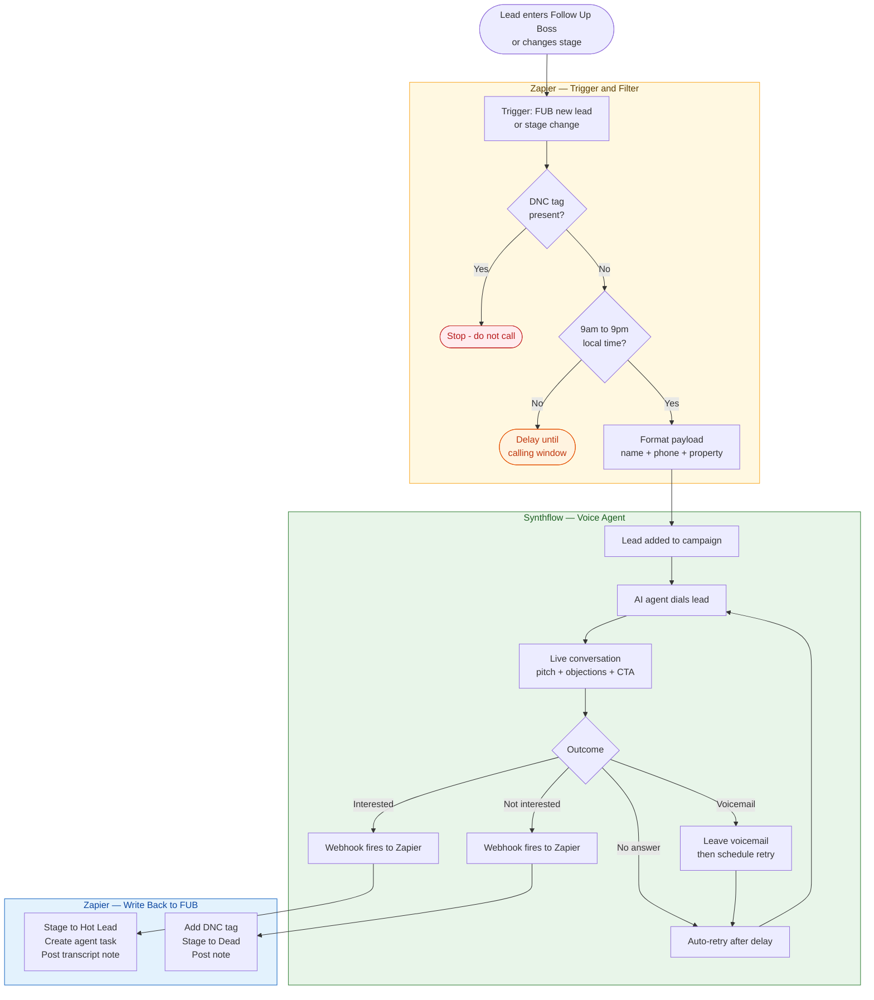
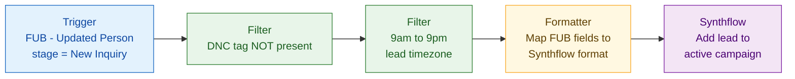
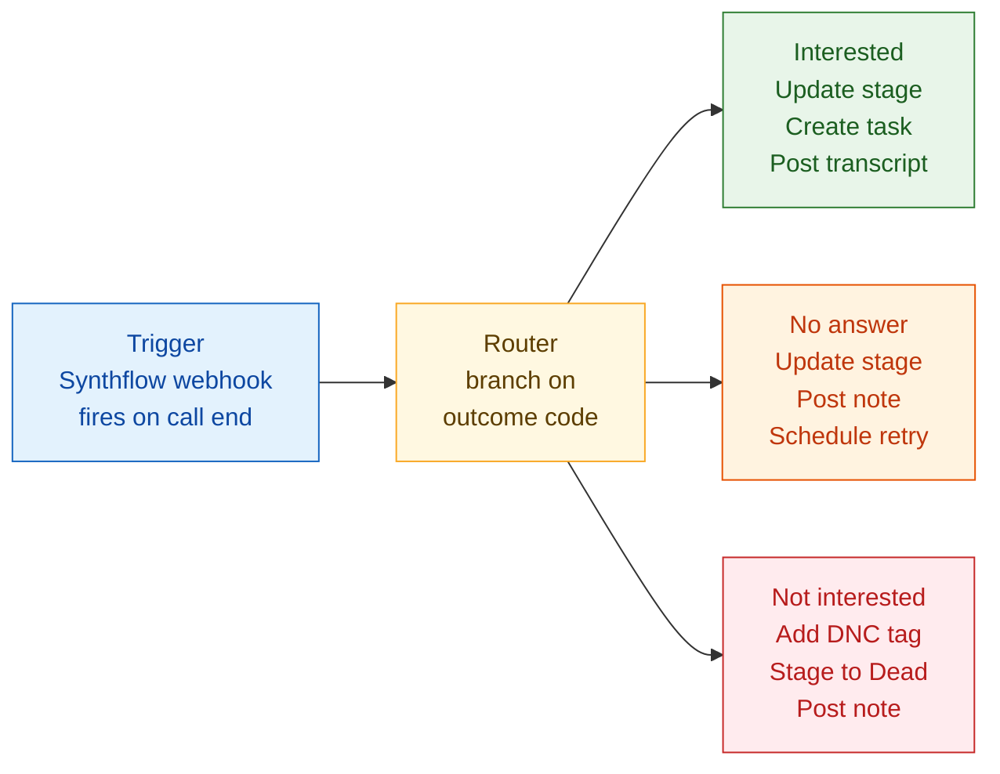
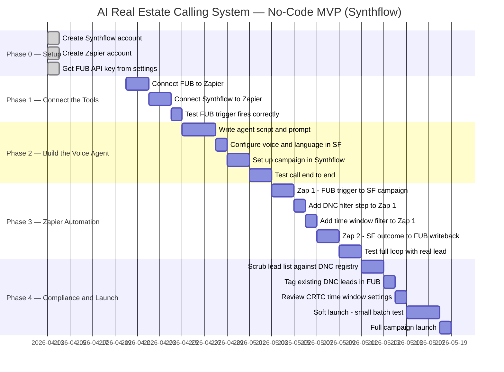

# 🏠 AI Real Estate Calling System — No-Code MVP

> An AI-powered outbound calling platform for real estate — built entirely with SaaS tools, no servers or code required. Pulls leads from Follow Up Boss, calls them via a Synthflow AI voice agent, and logs outcomes back automatically.

[](https://followupboss.com)
[](https://synthflow.ai)
[](https://zapier.com)
[](#compliance)
[](#the-three-tool-stack)

---

## Table of Contents

- [Overview](#overview)
- [The Three-Tool Stack](#the-three-tool-stack)
- [How It Works](#how-it-works)
- [Integration Flow](#integration-flow)
- [Zapier Setup](#zapier-setup)
- [Synthflow Setup](#synthflow-setup)
- [Follow Up Boss Setup](#follow-up-boss-setup)
- [Build Phases](#build-phases)
- [Compliance](#compliance)
- [DNC — Do Not Call](#dnc--do-not-call)
- [Costs](#costs)
- [Scaling Beyond MVP](#scaling-beyond-mvp)

---

## Overview

This is **Version 2** of the AI Real Estate Calling System — a no-code MVP.

```
Follow Up Boss  →  Zapier  →  Synthflow  →  Lead's phone
      ↑                               |
      └───────── Zapier ──────────────┘
             (writes outcome back)
```

**No EC2. No Podman. No Python. No GitHub deploys.**
The entire system runs from three browser tabs.

---

## The Three-Tool Stack

| Tool | Role | Replaces |
|---|---|---|
| **Follow Up Boss** | CRM — leads in, outcomes out | — |
| **Synthflow** | AI voice agent + campaign manager + dashboard | EC2 + FastAPI + Redis + voice platform code |
| **Zapier** | Connects FUB to Synthflow, enforces DNC and time rules | Worker queue + scheduler + webhook server |

### Why Synthflow for MVP

- True no-code setup — agent live in under an hour
- Built-in campaign manager with retry and voicemail detection
- ElevenLabs voices bundled — no separate TTS account needed
- Call transcripts and outcome dashboard included
- 200+ integrations including Zapier and GoHighLevel
- 14-day free trial — test before committing
- Real estate explicitly listed as a supported use case

---

## How It Works



---

## Integration Flow

### Outbound — FUB to Synthflow



### Return — Synthflow outcome to FUB



---

## Zapier Setup

### Zap 1 — Outbound trigger

| Step | Type | Configuration |
|---|---|---|
| 1 | **Trigger** | Follow Up Boss — New or Updated Person |
| 2 | **Filter** | Only continue if tag `DNC` is NOT present |
| 3 | **Filter** | Only continue if current time is between 09:00 and 21:00 in lead's timezone |
| 4 | **Formatter** | Map FUB fields: `name`, `phone`, `stage`, `assigned agent` |
| 5 | **Action** | Synthflow — Add Contact to Campaign |

### Zap 2 — Post-call return

| Step | Type | Configuration |
|---|---|---|
| 1 | **Trigger** | Webhooks by Zapier — Catch Hook (Synthflow fires this on call end) |
| 2 | **Router** | Branch on `disposition` field from Synthflow payload |
| 3a | **Branch: Interested** | FUB Update Person (stage → Hot Lead) + Create Note + Create Task |
| 3b | **Branch: No Answer** | FUB Update Person (stage → Contacted) + Create Note |
| 3c | **Branch: Not Interested** | FUB Update Person (add tag DNC, stage → Dead) + Create Note |

> **Tip:** Synthflow's webhook payload includes `transcript`, `duration_seconds`, `outcome`, and `recording_url`. Map all four into the FUB note so agents have full context on every call.

---

## Synthflow Setup

### 1. Create your AI agent

In the Synthflow dashboard:

- **Voice** — choose from the ElevenLabs library or clone your own in one click
- **Language** — English, French, and Spanish supported out of the box
- **Prompt** — paste the template below and fill in your property details

### Agent prompt template

```
You are [Agent Name], a friendly real estate assistant calling on behalf of [Company Name].

You are calling about [Property Name] located at [Address], listed at [Price].

Your goal is to gauge the lead's interest and offer to schedule a viewing.

Guidelines:
- Keep the call under 2 minutes
- Introduce yourself and the company within the first 10 seconds
- State the property address and price clearly and early
- Ask one clear question: "Would you be interested in scheduling a viewing this week?"
- If they say not interested: thank them warmly and end the call politely
- If they say call back later: ask for a preferred time and confirm it
- If they ask a question you cannot answer: offer to have an agent call them back
- Never fabricate property details you were not given
- Always identify yourself as an AI assistant if asked directly
```

### 2. Configure your campaign

In Synthflow Campaigns:

| Setting | Value |
|---|---|
| **Call window** | 9:00am – 9:00pm (matches CRTC / TCPA requirement) |
| **Retry attempts** | 2–3 retries, spaced 4 hours apart |
| **Voicemail detection** | Enabled — drop a short pre-recorded message |
| **Webhook on completion** | Paste the Zapier Catch Hook URL from Zap 2 |
| **Concurrent calls** | Start at 3–5, increase once call quality is confirmed |

### 3. Connect to Zapier

In Synthflow → Integrations → Zapier:
- Enable the integration
- Copy your Synthflow API key
- Paste into the Zapier Synthflow app connection

---

## Follow Up Boss Setup

### Stages to create

| Stage | Trigger | Meaning |
|---|---|---|
| `New Inquiry` | Lead enters FUB | Triggers outbound Zap 1 |
| `Contacted` | Zap 2 — no answer | Call placed, in retry queue |
| `Hot Lead` | Zap 2 — interested | Agent follow-up required today |
| `Dead` | Zap 2 — not interested | No further automated contact |

### Tags to create

| Tag | Set by | Meaning |
|---|---|---|
| `DNC` | Agent manually or Zap 2 automatically | Never call this lead again |
| `AI Called` | Zap 2 on every call completion | Audit trail — AI has contacted this person |

### How to manually mark a lead DNC

1. Open the lead profile in FUB
2. Click **Add Tag** on the left panel
3. Type `DNC` and save

Any lead with the `DNC` tag is caught by the Zapier filter in Zap 1 and never receives an automated call — regardless of which campaign or stage they are in.

---

## Build Phases



---

## Compliance

> Automated outbound calls are regulated. These rules are **legal requirements**, not suggestions.

### CRTC (Canada)

- [ ] Only call between **9am and 9pm local time** — set in Synthflow campaign settings
- [ ] Agent must **identify the business name** within the first 10 seconds of the call
- [ ] Provide an opt-out option: *"Press 9 to be removed from our list"* — configure in Synthflow
- [ ] Honour DNC requests **within 14 days** — automated via Zap 2 tagging
- [ ] Do not call numbers on the **National DNCL** — scrub before every campaign launch
- [ ] Retain call records for **minimum 24 months** — Synthflow stores transcripts; export monthly

### TCPA (United States)

- [ ] **Prior written consent required** for auto-dialed calls to cell phones
- [ ] Property inquiry = implied consent for **90 days** from inquiry date
- [ ] Prior completed transaction (sale / purchase) = **18 months**
- [ ] Honour the **National Do Not Call Registry**

---

## DNC — Do Not Call

A lead must be marked DNC in three situations:

| Situation | How the tag gets added |
|---|---|
| Lead says "remove me" or "don't call" during the AI call | Zap 2 adds `DNC` tag automatically via Synthflow webhook |
| Lead phones in and asks to be removed | Agent adds `DNC` tag manually in FUB |
| Number appears on National DNC Registry pre-scrub | Tag added during pre-campaign scrub before launch |

Once `DNC` is on a profile, **Zap 1 blocks that lead permanently** — no campaign will ever call them again.

To scrub your lead list before launch, use [CallAction Verify](https://callaction.co) — it checks FUB phone numbers against the National DNC Registry and flags matches directly in your account.

---

## Costs

### Monthly estimate at MVP scale (~1,000 calls/month)

| Tool | Plan | Approx. cost |
|---|---|---|
| **Synthflow** | Pro — 2,000 minutes included | ~$375/month |
| **Zapier** | Starter — 750 tasks/month | ~$20/month |
| **Follow Up Boss** | Your existing plan | — |
| **CallAction Verify** | DNC scrub — one-time per campaign | ~$30–50/scrub |
| **Total** | | **~$425–445/month** |

> At 1,000 calls averaging 2 minutes each = 2,000 minutes. Synthflow Pro covers this exactly. If calls average under 1.5 minutes you will stay comfortably within the cap.

### Cost per call

```
$375 Synthflow / 1,000 calls = $0.375 per call attempt
```

Compare to a human ISA at $15–25/hour making 20–30 calls/hour = **$0.50–$1.25 per call attempt** before salary overhead.

---

## Reference Links

| Resource | URL |
|---|---|
| Synthflow Dashboard | https://app.synthflow.ai |
| Synthflow Docs | https://docs.synthflow.ai |
| Synthflow + Zapier | https://zapier.com/apps/synthflow/integrations |
| Follow Up Boss API | https://docs.followupboss.com |
| Follow Up Boss + Zapier | https://zapier.com/apps/follow-up-boss/integrations |
| CallAction DNC Verify | https://callaction.co/verify |
| CRTC DNCL Rules | https://www.crtc.gc.ca/eng/phone/telemarketing.htm |
| National DNC Registry (US) | https://www.donotcall.gov |

---

<p align="center">
  <sub>AI Real Estate Calling System · No-Code MVP · Version 2 · April 2026</sub>
</p>
